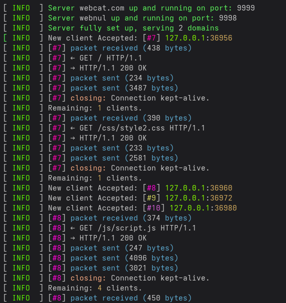

# Webserv

Webserv is a custom HTTP/1.1 web server written in C++ designed to behave as closely as possible to a production-grade NGINX-like server.

The goal of this project is to deeply understand low-level network programming, HTTP protocol behavior, and server architecture by reimplementing core web server features from scratch.

### Example terminal output


---

## Overview

This server implements a fully configurable HTTP server capable of handling multiple virtual hosts, routing requests, serving static files, executing CGI scripts, and managing uploads.

It aims to provide:
- Accurate HTTP/1.1 behavior
- Precise HTTP status codes and error handling
- NGINX-inspired configuration system
- Support for real-world-like routing rules and policies

---


## Features

### HTTP Support
- HTTP/1.1 protocol
- Methods:
  - GET
  - POST
  - DELETE
  - HEAD
  - OPTIONS
  - PUT
- Keep-alive connection handling
- Proper header parsing and validation
- Accurate HTTP error codes (400, 403, 404, 405, 413, 500, etc.)

### Server Features
- Multiple virtual servers (multi-listen support)
- Non-blocking I/O (poll/select based implementation)
- Static file serving
- Directory listing (autoindex on/off)
- File upload handling (multipart/form-data)
- Upload policies:
  - reject
  - replace
  - append
- Per-location routing system
- Client max body size enforcement (global + per location)

### CGI
- CGI execution support for dynamic content
- Configurable interpreters (PHP, Python, custom binaries)
- Environment variable passing compliant with HTTP spec

### Configuration System
- NGINX-like hierarchical config file
- Server blocks
- Location blocks
- Global MIME type registry
- Global CGI registry

---

## Build

The project is built using a standard Makefile.

### Compile and run
```bash
make a
```

This command compiles the project and launches the server.
## Other build commands

```bash
make        # compile only
make clean  # remove object files
make fclean # remove all generated files
make re     # full rebuild
```

---

## Usage

Run the server with the configuration file:

```bash
./webserv data/config_file.conf
```

---

## Configuration File

The configuration file is located at:

```
data/config_file.conf
```

It is structured similarly to NGINX and supports:

- Multiple server blocks
- Nested location blocks
- MIME type declarations
- CGI mappings

---

## Example Configuration

### Server 1

Listens on port 9999 with domain `webcat.com`:

- Root: `www/webcat.com/website`
- Default method: GET only on `/`
- Upload behavior controlled via `post_policy`
- CGI enabled for `/login`

**Key locations:**

- `/img` → static images  
- `/css` → stylesheets  
- `/js` → scripts  
- `/donations` → full CRUD support with autoindex enabled  
- `/login` → PHP CGI execution  

---

## Configuration Features

### Server block

Defines a virtual host:

- listen port
- server_name
- root directory
- global client max body size

---

### Location block

Defines routing rules per path:

- root override
- allowed HTTP methods
- autoindex
- index file
- upload policy
- CGI interpreter
- body size override

---

## Global Blocks

### MIME types

Used to map file extensions to Content-Type headers:

- html → text/html; charset=utf-8  
- css → text/css; charset=utf-8  
- js → application/javascript; charset=utf-8  
- png/jpg/gif → image/*  
- mp4/mp3 → media types  

---

### CGI registry

Maps file extensions to executables:

- `.php` → /usr/bin/php-cgi  
- `.py` → /usr/bin/python3  
- custom binary support  

---


# Notes

- The server comes with a pre-built static website written in HTML, CSS, and JavaScript, included for demonstration and testing purposes.

---

### Usage (webcat website)

After launching the server, open your browser and connect to:

```bash
http://localhost:9999
```

- Also comes with a `Log` c++ stand alone class that can be used in any of your c++ project


### usage of log

```C++
	Log& logger = Log::instance();

	if (!logger.getStatus()) {
		std::cerr << "Log failed to setup" << std::endl;
		return FAILURE;
	}
```

## Logging System (C++ Standalone Class)

The project includes a standalone `Log` class that can be reused in any C++ project.  
It provides a flexible, level-based logging system with both terminal output and file logging support.

It is designed with:
- Singleton access
- Compile-time log filtering
- Runtime log file generation
- Colored terminal output
- Automatic log file stripping of ANSI colors

---

## Features

- Singleton logger (`Log::instance()`)
- Multiple log levels:
  - SYSTEM ERROR
  - ERROR
  - WARNING
  - INFO
  - DEBUG
  - LOG
- Compile-time filtering via `LOG_LEVEL` and `PRINT_LEVEL`
- Automatic log file creation in `log/` directory
- Timestamped log files
- ANSI color removal for file output
- Not Thread-safe
---

## Usage

### Basic initialization

```C++
Log& logger = Log::instance();

if (!logger.getStatus()) {
    std::cerr << "Log failed to setup" << std::endl;
    return FAILURE;
}
```

---

### Recommended usage via macros

The class is designed to be used mainly through macros:

```C++
LOG_ERROR("Failed to open file: " << filename);
LOG_WARNING("Low memory detected");
LOG_INFO("Server started on port " << port);
LOG_DEBUG("Request received: " << request);
LOG_LOG("Generic log message");
LOG_ERROR_SYS("System call failed");
LOG_HERE("Debug checkpoint reached");
```

---

## Log Levels

### Available levels

- `LVL_ERROR_SYSTEM`
- `LVL_ERROR`
- `LVL_WARNING`
- `LVL_INFO`
- `LVL_DEBUG`
- `LVL_LOG`

---

### Compile-time control

You can control output using:

```C++
#define LOG_LEVEL   (LVL_ERROR_SYSTEM | LVL_ERROR | LVL_DEBUG | LVL_LOG)
#define PRINT_LEVEL (LVL_ERROR_SYSTEM | LVL_ERROR | LVL_WARNING | LVL_INFO)
```

This allows:
- disabling logs in production
- keeping only critical errors
- enabling debug logs during development

---

## Log Output

### Terminal output

Logs are printed with colored prefixes depending on severity.

### File output

Logs are stored in:

```text
log/webserv_log_YYYYMMDD_HHMMSS.log
```

Each run generates a new timestamped file automatically.

---

## Behavior Details

- If the `log/` directory does not exist, it is created automatically
- If file creation fails, logging is disabled safely
- ANSI color codes are removed from file output
- System errors append `strerror(errno)` automatically
- Logging uses low-level `write()` for file output

---

## Architecture Notes

The logging system is composed of:

- Singleton `Log` instance
- Internal file descriptor (`_fd`)
- Log level filtering via macros
- Stream-based macro interface (`std::ostringstream`)
- Runtime-safe initialization (`createLogging()`)

---

## Example

```C++
LOG_INFO("Server started successfully");
LOG_DEBUG("Listening on port " << port);
LOG_ERROR_SYS("Socket creation failed");
```

---

## Summary

This logger provides a lightweight, reusable, and configurable logging system suitable for:
- network servers
- system-level projects
- debugging-heavy applications

It is fully decoupled from the Webserv project and can be reused independently.